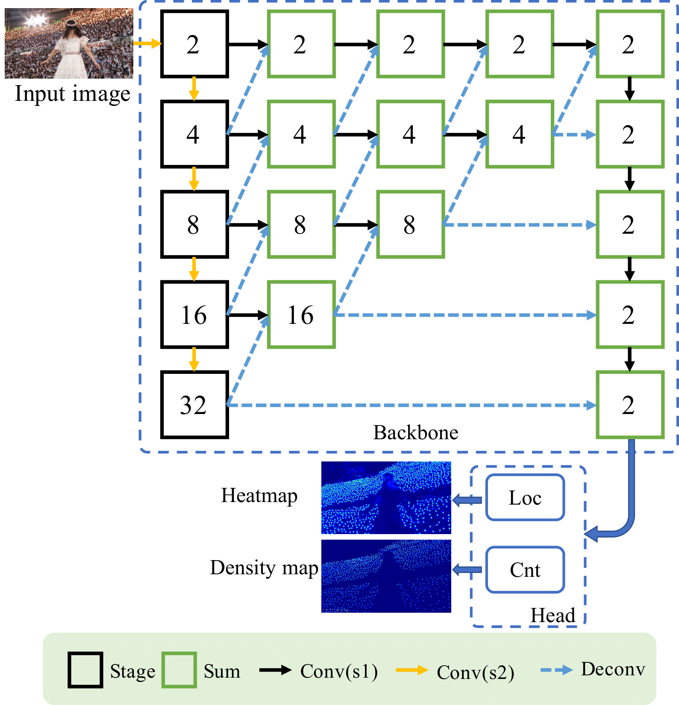
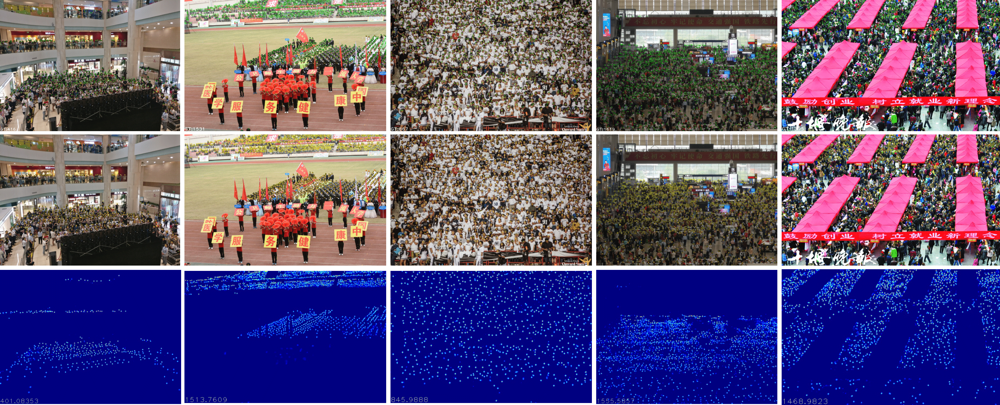

# Dense Point Prediction: A Simple Baseline for Crowd Counting and Localization
This work was finished in Dec. 2020, and accepted by IEEE ICME Workshop, 2021 [(arXiv version).](https://arxiv.org/abs/2104.12505)
The code is developed based on the framework [Deep Structured Scale Integration Network, ICCV, 2019](https://github.com/Legion56/Counting-ICCV-DSSINet) and [CenterNet.](https://github.com/xingyizhou/CenterNet)

## Introduction
In this repo, we introduce a simple baseline for crowd counting and localization network, named SCALNet. Unlike most existing works that separate the counting and localization tasks, we consider those tasks as a pixel-wise dense prediction problem and integrate them into an end-to-end framework.


<p> Figure 1. Network architecture of SCALNet. The numbers inside the nodes denote the stride value, indicating the feature size compared with the input size (e.g., the stride of 2 means 1/2 of input size). Sum nodes indicate pixel-by-pixel summation of two features. Conv(sx) denotes the convolution with the stride of x. Deconv means the transposed convolution (or deconvolution). </p>


## Usage
### Requirements
```
CUDA 10.0 or higher
Python 2.7
opencv, PIL, scikit-learn
pytorch 0.4.2 or or higher
```

### Data preprocessing
#### Datasets
[NWPU-Crowd](https://www.crowdbenchmark.com/)

#### Setting up

1. Dataset downloading.
We download the training and validation images and annotations at [NWPU-Crowd](https://www.crowdbenchmark.com/) and organize it in `data/NWPU-Crowd` with the folder tree:
```
-- NWPU-Crowd
    |-- train_data
        |-- images
            |-- 0001.jpg
            |-- 0002.jpg
            |-- ...
            |-- 3109.jpg
            |-- 3169.jpg (special index according to train.txt)
        |-- ground_truth
            |-- 0001.mat
            |-- ...
            |-- 3109.mat
            |-- 3169.mat (special index according to train.txt)
    |--test_data
        |-- images
            |-- 3098.jpg (special index according to val.txt)
            |-- 3110.jpg
            |-- ...
            |-- 3609.jpg
        |-- ground_truth
            |-- 3098.mat (special index according to val.txt)
            |-- 3110.mat
            |-- ...
            |-- 3609.mat
    |--testing_data
         |-- images
            |-- 3610.jpg
            |-- 3611.mat
            |-- ...
            |-- 5109.jpg
    |--test.txt
 ```
* Folders train_data (3109 images), test_data (500 images), testing_data(1500 images) correspond to the train, validation, test sets.
Special case is the exchange of 3169.jpg and 3098.jpg in the training and validation sets. The other samples are organized orderly. 
You can write a script to do so according to the train.txt, val.txt and test.txt.

2. Edit `/src/datasets.py`  to change the path to your original dataset foldered as the dataset and set the density maps setting including, sigma for gaussian kernel, train_val split and mean_std;

### Training
```
python train.py --model DLANet --dataset NWPU --batch_size 32 --loss LocLoss --gpus 0 --lr 0.0001 --epochs 20 --save_model_interval 2 --preload --save
```

Please refer to /src/train_options.py for more options; Default scripts for training avaliable on /scripts/train.sh
### Testing on the validation set
```
# generate txt for searching best threshold (thr) on val set. If we set 0.4 thr, the generate txt with thr [0.38,0.39,0.4,0.41,0.42]
python testall.py --dataset NWPU --model_name DLANet --no-preload --no-wait --gpus 0 --test_batch_size 1 --model_path saved_models/000018.h5  --det_thr 0.4 --save_txt

# search the best thr on val set. choose it from output info (F-measure, precision, recall). Takes some minutes. We choose 0.39.
# need to change the pred_folder in eval_search_thr.py if use other models.
python eval/eval_search_thr.py

# add --save to generate demo image on val set using thr of 0.39
python testall.py --dataset NWPU --model_name DLANet --no-preload --no-wait --gpus 0 --test_batch_size 1 --model_path saved_models/000018.h5  --det_thr 0.39 --save

```
Please refer to /testall.py for more options; Default scripts for testing avaliable on /scripts/test.sh

### Testing on the test set

```
# unlabel testing on the test set
python test_nwpu_loc.py --dataset NWPU_unlabel --model_name DLANet --no-preload --no-wait --gpus 0 --test_batch_size 1 --model_path saved_models/000018.h5 --save_txt --det_thr 0.39
```

Submit the txt result in `saved_models/000018/output/0/loc_txt_test/DLA_loc_test_thr_0.39.txt` to [NWPU-Crowd Benchmark](https://www.crowdbenchmark.com/usersubmit.html) for localization evaluation, 
and the txt result in `saved_models/000018/output/0/loc_txt_test/DLA_cnt_test_den.txt` to [NWPU-Crowd Benchmark](https://www.crowdbenchmark.com/usersubmit.html) for counting evaluation,


### Models
To reproduce the results of Tables 2 and 3 in our paper, we have provided the models. You can download them through [Onedrive](https://entuedu-my.sharepoint.com/:u:/g/personal/wang1241_e_ntu_edu_sg/EZAUqu0cpE9Mh60aWauYwRYB2iVZvQuBol6ynovL026ZkA?e=RGhEa4).
And put it in the `./saved_models/`


### Localization Performance on the Test set

| Method | F1-measure| Precision | Recall 
| ---- | ---- | ---- |  ---- |
| [RAZ-Loc, CVPR2019](https://openaccess.thecvf.com/content_CVPR_2019/html/Liu_Recurrent_Attentive_Zooming_for_Joint_Crowd_Counting_and_Precise_Localization_CVPR_2019_paper.html)| 59.8 | 66.6 | 54.3 |
| [Crowd-SDNet, TIP2021](https://arxiv.org/abs/2007.12831)| 63.7 | 65.1  | 62.4 |
| SCALNet (ours)| <strong>69.1</strong> | <strong>69.2</strong> | <strong>69.0</strong> |

Refer to the [leaderboard](https://www.crowdbenchmark.com/nwpucrowdloc.html) to compare with recent localization works.

### Counting Performance on the Test set

| Dataset | MAE | MSE | NAE |
|  ---- |  ---- | ---- |---- |
| [BL, ICCV2019](https://arxiv.org/abs/1908.03684)| 105.4 | 454.2 | <strong>0.203</strong>|
| [SFCN, CVPR2019](https://arxiv.org/abs/1903.03303)| 105.7 | 424.1 | 0.254|
| SCALNet (ours)| <strong>86.8</strong> | <strong>339.9</strong> | 0.218|

Refer to the [leaderboard](https://www.crowdbenchmark.com/nwpucrowd.html) to compare with recent counting works.

### Visual Results of the proposed method


Figure 2. Qualitative results of our method. 
The first row shows ground-truth point annotations (green circles) with the counts shown at the bottom-left corner. 
The second row shows the predicted head locations (yellow circles). 
The third row shows the predicted density maps and counts. Zoom in the figure for better viewing.

## Citation 
If you find this paper and code useful in your research, please cite our papers.

```
@misc{wang2021dense,
      title={Dense Point Prediction: A Simple Baseline for Crowd Counting and Localization}, 
      author={Yi Wang and Xinyu Hou and Lap-Pui Chau},
      year={2021},
      eprint={2104.12505},
      archivePrefix={arXiv},
      primaryClass={cs.CV}
}
```

and another work [Crowd-SDNet, TIP2021](https://arxiv.org/abs/2007.12831) for point-supervised self-detection of crowds.
```
@article{wang2021self_training,
  title={A Self-Training Approach for Point-Supervised Object Detection and Counting in Crowds},
  author={Wang, Yi and Hou, Junhui and Hou, Xinyu and Chau, Lap-Pui},
  journal={IEEE Transactions on Image Processing},
  volume={30},
  pages={2876--2887},
  year={2021},
  publisher={IEEE}
}
```
